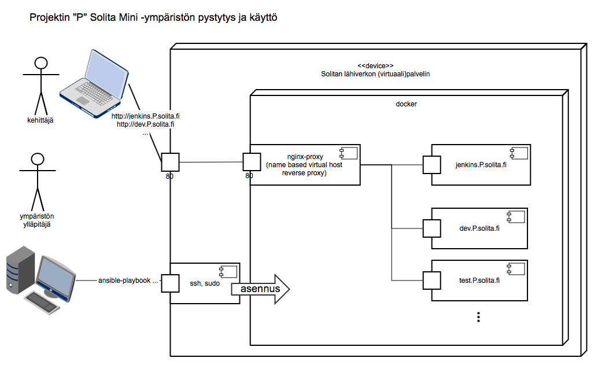

# tykkays20-solmini-env

Minimalistinen Solitan infraan nivoutuva projekti-infra.

Toteutus yksinkertainen Shell-skripti, joka ajetaan RHEL7 koneessa ylläpito-
oikeuksin.



## Vaatimukset

RHEL7, internet, levytilaa, ylläpito-oikeudet, DNS cname *.tykkays20.solita.fi osoittamaan palvelimelle
tai clienteille hosts tiedosto


ssh-tunnus, jolla on wheel group kohdepalvelimella

## Clone & Run

Ansible riippuvuuksien kansiot ovat git subproject:ja, eli niiden saamiseksi versionhallinnasta pitää
projekti kloonata komennolla

`[petrisi@bonaqua ~]$ git clone --recursive ...`

Kun managed server on saatavilla pitää Ansiblen käyttöä varten luoda tunnus ja antaa sille sudo oikeudet.
CentOS7/RHEL7:ssa tämä menee näin:

````bash
[root@jallu3 ~]# useradd petrisi
[root@jallu3 ~]# passwd petrisi
Vaihdetaan käyttäjän petrisi salasana.
Uusi salasana:
Anna uudelleen uusi salasana:
passwd: kaikki todennuspoletit päivitetty.
[root@jallu3 ~]# usermod -aG wheel petrisi
````

Suorita skripti:

````bash
[petrisi@bonaqua ~]$ ansible-playbook -i dev-inventory --ask-become-pass tykkays20.yml
````

, joka asentaa:

- Dockerin
- nginx front reverse proxyn virtual host automaatilla
- (dev|test|qa|prod).solmini.tykkays20.solita.fi demo palvelut (nginx), ja laittaa sinne tarjolle Hello, world! sivun.
- Jenkins CI palvelimen (jenkins.solmini.tykkays20.solita.fi)

Asennus kestää Jenkinsin osalta hetkisen, kun ladataan 689 Mt image.

Käy selaimella osotteessa:

`dev.solmini.tykkays20.solita.fi` tai `jenkins.solmini.tykkays20.solita.fi`

## Todo

- Jenkins swarm slave ohje
- Jenkins jobien konfiguroinnin järkevä toteutus
- Vaihtoehtoinen esimerkkisovellus, jossa vaikkapa python + tietokanta
- Deploy pipeline, jossa sovellus paketoidaan konttiin ja sovelluskontti paketoidaan edelleen ympäristökohtaiseen konttiin, joka deployataan kyseiseen ympäristöön.
- Salaisuuksien hallintamalli, jossa mm. tuki asiakkaan luotettavaan salaisuuden paketoimiseen ja käyttöön tuotannossa. Tässä Solitalla ei saa olla mahdollisuutta salaisuuden avaamiseen.