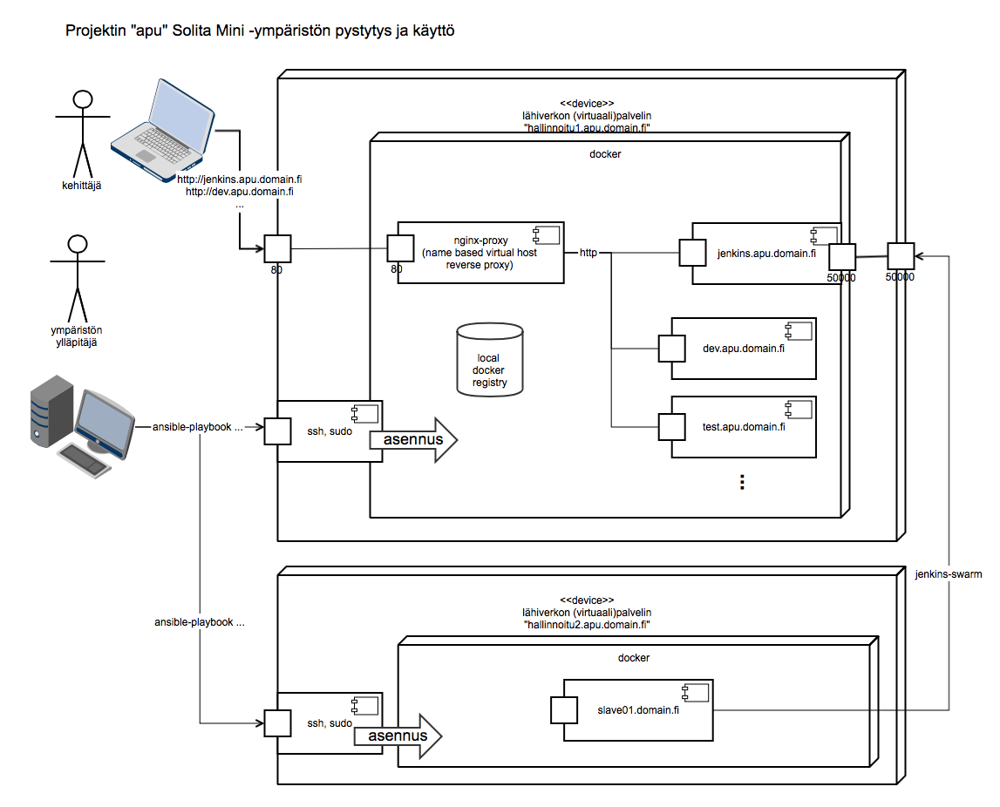

# tykkays20-solmini-env

## Yleistä

Tykkäys 2.0 on pelkistetty web-sovellusprojektin kehitys alusta, joka tarjoaa projektitiimille nopeasti jaetun laadunvarmistus- , continous delivery- ja demo-ympäristön. 

Perinteisesti näiden ympäristöjen pystytys ja ylläpito on vaatinut projektin alkuvaiheessa useiden henkilötyöpäivien panosta ja kestänyt kalenteriajassa viikkoja. Tykkäys 2.0:n tavoitteena on puristaa tämä työ- ja kalenteriaika noin 20 minuttiin.

Lisähyötynä muodostettava ympäristö on paremmin toistettavissa ja kahdennettavissa. Edelleen ympäristön kuvaus noudattaa projektin elinkaaren muiden vaiheiden kannalta yhtenäistä tyyliä ja tekniikkaa, josta toivotaan olevan apua projektin siirtyessä alkuvaiheista tuotantoon ja ylläpitoon.

## Toteutus 

Toteutus on ansible-playbook, joka ajetaan dev-inventory tiedostossa mainituille kahdelle koneelle. Sisäisesti alusta käyttää docker-kontteja, jotta pienet virtuaalikoneetkin riittävät kaikkien palveluiden ajamiseen.



## Vaatimukset

2 x CentOS/RHEL7 hallittava palvelin, internet-yhteys, levytilaa ~ 3Gb, ylläpito-oikeudet, DNS cname `*.ali.domain.fi` osoittamaan palvelimelle.

## Käyttöönotto

Ansible riippuvuuksien kansiot ovat git subproject:ja, eli niiden saamiseksi versionhallinnasta pitää projekti kloonata komennolla

`[user@hallinta ~]$ git clone --recursive https://github.com/solita/tykkays20-solmini-env.git`

Hallittavalle koneelle on Ansiblen käyttöä varten luotava tunnus ja annettava sille sudo oikeudet.
CentOS7/RHEL7:ssa tämä menee näin:

````bash
[root@hallittava1 ~]# useradd centos
[root@hallittava1 ~]# passwd centos
Vaihdetaan käyttäjän centos salasana.
Uusi salasana:
Anna uudelleen uusi salasana:
passwd: kaikki todennuspoletit päivitetty.
[root@hallittava1 ~]# usermod -aG wheel centos
````

Edelleen hallittavalle koneelle on kopioitava hallitsevan koneen ssh-avain, jotta ansible pystyy suorittamaan siellä asennuksen.
````bash
[user@hallinta ~]$ ssh-copy-id centos@hallittava1.ali.domain.fi
[user@hallinta ~]$ ssh-copy-id centos@hallittava2.ali.domain.fi
````

Asennettavien koneiden (master ja slave) nimet pitää muokata `dev-inventory` tiedostoon:

````yaml
[master]
hallittava1.ali.domain.fi
[slave]
hallittava2.ali.domain.fi
[master:vars]
domain="ali.domain.fi"
````

Ympäristön asennus tapahtuu suorittamalla skripti:

````bash
[petrisi@bonaqua ~]$ ansible-playbook -i dev-inventory -u centos --ask-become-pass tykkays20.yml
````

, joka asentaa:

hallittava1 koneelle (dev-inventory, master-group):
 - Dockerin + Docker ansible modulin tarvitsemat riippuvuudet
 - nginx front reverse proxyn virtual host automaatilla
 - (dev|test|qa|prod).solmini.tykkays20.solita.fi demo palvelut (nginx), ja laittaa sinne tarjolle Hello, world! sivun.
 - Jenkins CI palvelimen (jenkins.solmini.tykkays20.solita.fi)

hallittava2 koneelle (dev-inventory, slave-group)
 - Dockerin + Docker ansible modulin tarvitsemat riippuvuudet

TODO: Slaven käynnistys pitää tehdä vielä käsin slave-koneella, koska Ansible docker moduli ei tue slaven tarvitsemia komentoriviargumentteja.

Asennus kestää Jenkinsin osalta hetkisen, kun ladataan 689 Mt image. Image on toistaiseksi minun käsin räätälöimä, koska Jenkins asennusta ei kokonaisuudessaan voitu automatisoida (https://github.com/sirkkalap/jenkins-swarm-w-git)

Käy selaimella osotteessa:

`dev.apu.domain.fi` tai `jenkins.apu.domain.fi`

## Todo

- Jenkins jobien konfiguroinnin järkevä toteutus, pipeline
- Vaihtoehtoinen esimerkkisovellus, jossa vaikkapa python + tietokanta
- Deploy pipeline, jossa sovellus paketoidaan konttiin ja sovelluskontti paketoidaan edelleen ympäristökohtaiseen konttiin, joka deployataan kyseiseen ympäristöön.
- Salaisuuksien hallintamalli, jossa mm. tuki asiakkaan luotettavaan salaisuuden paketoimiseen ja käyttöön tuotannossa. Tässä Solitalla ei saa olla mahdollisuutta tuotannon salaisuuksien avaamiseen.
- Imagejen optimointi, jotta turhaa levytilaa ei kuluisi. Samalla Jenkins imagen muuttaminen puhtaaksi Dockerfile-muotoon, jos mahdollista nyt.
- Ohjeistus docker repositoryn käyttämiseksi cachena, jotta minimoitaisiin internetliikenne alustaa kehitettäessä ja silloin , kun alustalla on useita projekteja käyttäjina.
